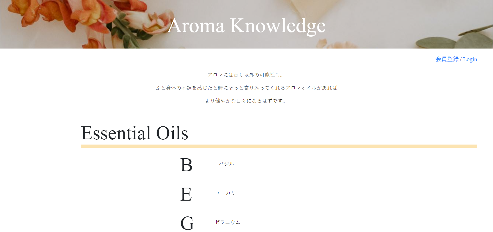

## サイト説明
PHPで作成したエッセンシャルオイルに関する投稿サイトです。
あえてLaravelを使用せず、MVCの概念に沿って作成しております。  
エッセンシャルオイルは基本情報と写真を投稿できます。
さらに、各エッセンシャルオイルが持つ効能が複数あり、それを紐づけるために
効能を登録し、関連登録では、各オイルと効能を登録できるようにしました。  

登録ができるのは会員登録されたユーザのみ、
各登録情報を編集、削除できるのは登録したユーザのみと制限しています。

テーブル構成は以下の通りです。  
・essential_oils：オイル情報を格納したテーブル  
・effects：効能情報を格納したテーブル  
・relations：オイル情報と効能情報を紐づけるテーブル  
・users：登録ユーザーテーブル  

## 技術要素
・開発環境：AWS Cloud9/ Amazon Linux  
・HTML/css  
・bootstrap 4.3.  
・JavaScript/jQuery  
・PHP 5.6.40  
・mysql Ver14.14 Distrib 5.5.62  
・PDO  
・バージョン管理：GitHub  
・デプロイ：Xfree  

## 機能一覧
・ユーザー登録機能  
・ログイン/ログアウト機能  
・エッセンシャルオイル/効能/関連登録機能  
・ユーザー制限付き情報更新/削除機能  
・情報一覧表示機能  
・登録情報表示機能  
・重複登録制限機能  
・各種フラッシュメッセージ表示機能  
・入力値に関するバリデーション機能  
・不正アクセス防止機能
   -ユーザーログアウト状態でのURL指定アクセス  
  

## 実行画面の様子

## リンク
http://aroma2021.php.xdomain.jp/Essential_Oils/index.php  
Test User  
address : test@gmail.com  
password : test

## エピソード
現在勉強しているアロマテラピーに関して、まとめるサイトが欲しいと思い作成しました。  
バックエンド部分では3つのテーブル(essential_oils/effects/relations)を用いて、多対多(essential_oils/effects)で関連付ける中間テーブル(relations)を作成し、
一つのオイルが持つ効能を複数登録できるようにしています。  
また、ユーザー制限をつけて、登録した人だけが編集、削除できる機能をつけ、
各アクションに対してフラッシュメッセージを表示させています。

フロント部分では、一覧で植物名と写真を紐づけて表示させることにこだわりました。
今後は、検索機能や詳しい使用方法(レシピ)を登録、表示できる機能や、各情報に対してコメントできる機能など拡張を検討しております。  

制作期間:約2か月

## 作成者
2021/07/01  
Tomomi TAKAOKA (tomomi19921214@gmail.com)  
